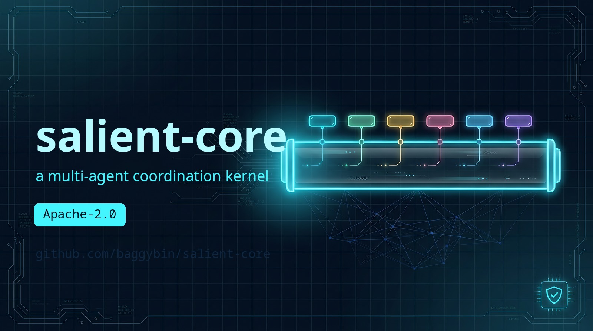

# salient-core

> An auditable, policy-first coordination kernel for high-consequence local agents.



[](https://github.com/baggybin/salient-core/actions/workflows/ci.yml)
[](LICENSE)

`salient-core` is a coordination kernel for running multiple local agents in
settings where **the cost of a wrong action is high** — so every tool call is
gated *below the model*, and every decision is written to an auditable trail.
Agents run concurrently on your own infrastructure, each scoped to a single tool
surface, coordinated over a typed inter-agent bus with a human operator in the
approval loop.

Two properties define it:

- **Policy-first.** Scope and safeguard gates run *below* the model on every
  tool invocation and default to **deny** — a confused or compromised agent
  still cannot exceed its scope. Policy is the substrate, not a prompt
  convention layered on top.
- **Auditable.** Every scope decision, tool call, and operator answer is
  persisted — with secrets redacted — so you can reconstruct exactly what each
  agent did, what was allowed or denied, and why. Built for work you must be
  able to *prove* after the fact, not merely trust in the moment.

The kernel was extracted from Salient, a multi-agent security orchestrator
(private). The security-specific code stayed behind; what's here is the
coordination layer that generalizes to any high-consequence domain.

**Showcase application:** [salient-tutor](https://github.com/baggybin/salient-tutor) —
a Socratic teaching agent built on this kernel.

## Why salient-core

Reach for it when you have **more than one Claude agent that must cooperate**,
you **don't trust each agent with the others' tool surfaces**, you want a
**human in the approval loop**, and you need to **prove afterward what every
agent did**. The kernel provides the coordination glue you'd otherwise
hand-roll: a typed inter-agent bus, per-tool-call policy gates enforced *below*
the model (so a compromised or confused agent still can't exceed its scope), an
operator inbox for decisions that need a human, a redacted audit trail of every
gate decision and tool call, and a cross-session knowledge graph that persists
what agents learn.

What makes it distinct from in-process orchestrators (LangGraph, CrewAI,
AutoGen): coordination happens over an **MCP bus** rather than a Python call
graph, policy is a **default-deny gate under the model** rather than a prompt
convention, and delegation is **operator-mediated** rather than fully
autonomous.

**When *not* to use it:** single-agent workflows (the coordination layer is
overhead you don't need), non-Claude backends today (v1 requires the Claude
Agent SDK; other SDKs are a v2 goal behind the `AgentBackend` seam), or if you
want a no-code / hosted orchestration runtime — this is a library kernel you
wire into your own daemon.

## How it works

Every agent runs its own Claude SDK loop with a single **bus MCP server**
attached. When an agent calls a tool, the call passes through the **scope +
safeguard gates** *before* it executes; anything that needs a human is routed
to the **operator inbox**; what agents learn is corroborated into a shared
**knowledge graph**. The kernel's value is this topology, not any one box.

A denied call never runs. A delegation to another agent, or a decision the
model isn't allowed to make alone, lands in the operator inbox as a typed
question and waits for an answer. See
[`docs/ARCHITECTURE.md`](docs/ARCHITECTURE.md) for the full data-flow and
persistence model.

<p align="center">
  
</p>

## How it compares

| | salient-core | LangGraph | CrewAI / AutoGen |
|---|---|---|---|
| **Coordination primitive** | typed **MCP bus** per agent | in-process state graph | in-process agent/role objects |
| **Policy / gating** | **default-deny gate below the model**, per tool call | prompt- / code-level, in-graph | prompt-level convention |
| **Human-in-the-loop** | first-class **operator inbox** (typed Q/A) | interrupts / checkpoints | optional human proxy |
| **Auditability** | **redacted, replayable trail** of every gate decision + tool call | app-level logging | app-level logging |
| **Cross-session memory** | **noisy-OR knowledge graph** w/ corroboration + embeddings | checkpointer state | external memory add-ons |
| **Isolation** | per-agent tool subprocess, optional privilege separation | shared process | shared process |
| **Backends** | Claude SDK today (`AgentBackend` seam for more) | many LLMs | many LLMs |

The trade is deliberate: salient-core is narrower (Claude-native, library-not-
runtime) in exchange for **enforced** scoping and **mediated** delegation —
built for settings where agents must be *constrained*, not merely orchestrated.

## What's in the kernel

| Component | What it does |
|---|---|
| **Bus-as-MCP** | ~40 typed inter-agent tools (delegation, context, KG, discovery, audit) exposed as a single MCP server per agent, with an `extra_tools` slot for domain add-ons |
| **Noisy-OR KG** | Cross-session knowledge graph with corroboration, embeddings, and archive-first compaction |
| **Policy gates** | Scope + safeguards enforced *below* the model — default-deny on every tool invocation |
| **Audit trail** | Scope decisions, tool I/O, and operator answers persisted with secret redaction — a replayable record of what ran and what was denied, plus a sticky degraded-health flag when a record can't be written |
| **Operator inbox** | Typed question/answer pattern for anything that needs a human decision |
| **SM-2 scheduler** | Spaced-repetition gradebook for durable recall tracking |
| **[`ask_fable`](src/salient_core/ask_fable/README.md)** | Gated MCP sidecar: any agent can request narrow code/architecture reasoning from Fable (`claude-fable-5`), behind the same denylist guard + a hashed, owner-only audit log — concrete proof the policy gates are real, not aspirational (optional `[ask-fable]` extra) |
| **Runner** | **Today: requires the Claude Agent SDK** (v1). The `AgentBackend` / `DaemonServices` Protocols exist so v2 can host other SDKs — none are implemented yet. Per-agent tool subprocesses can be privilege-separated via an opaque `_launch_profile` seam |

## Requirements

- **Python ≥ 3.11**
- **[`claude-agent-sdk`](https://pypi.org/project/claude-agent-sdk/) `>=0.2.110,<0.3`** —
  pulled in automatically. The runner drives Claude agents through it, so you
  need Claude access: either an `ANTHROPIC_API_KEY`, or (for the `ask_fable`
  sidecar) an existing Claude Code OAuth session.
- Optional extra: `pip install 'salient-core[ask-fable]'` adds the `mcp`
  transport for the [`ask_fable`](src/salient_core/ask_fable/README.md) reasoning
  server.

> **Default-deny, out of the box.** The kernel ships with an *empty* scope and
> safeguard dataset, and the scope gate defaults to **deny** — an engagement
> with no scope set refuses **every** tool call. Populate `ScopeStore` /
> `SafeguardConfig` at startup (see [`docs/EXTRACTION.md`](docs/EXTRACTION.md#data-tables))
> before agents can do anything. This is intentional: policy is opt-in-safe.

## Quick start

```bash
pip install salient-core
```

### Run the multi-agent showcase

The kernel's actual job — fanning one prompt across a panel of agents over the
bus, capturing each leg's reasoning, and scoring **semantic convergence** —
runs offline with no API key:

```bash
pip install salient-core starlette uvicorn
cd examples/consensus_panel
uvicorn server:app --reload      # → http://127.0.0.1:8055
```

This exercises the real `ask_consensus` machinery
(`salient_core.bus._consensus`): same-prompt fan-out, per-leg trace capture,
embedding-based agreement scoring, and the parameterizable judge. See
[`examples/consensus_panel/`](examples/consensus_panel/README.md) for how to
swap the mock runner for live models. For a full application built on the
kernel, see [`salient-tutor`](https://github.com/baggybin/salient-tutor).

### Standalone modules

Several pieces work without wiring up the full daemon — e.g. the SM-2
scheduler and the knowledge graph:

```python
from salient_core.tutor.schedule import next_interval_days, next_mastery

interval = next_interval_days(prev_days=7.0, grade="good")  # → ~16.1
mastery = next_mastery(prev_mastery=0.5, grade="easy")      # → ~0.75
```

## Seams

The kernel ships no app-specific ("skin") code. Instead it exposes two kinds of
plug-in points, and a downstream application (the security skin, the tutor
showcase, or your own project) fills them in at startup:

- **Protocol contracts** — the typed surfaces a downstream implements
  (`DaemonServices`, `ToolBuilder`, `AliasProtocol`, `AgentBackend` in
  `salient_core.protocols`).
- **Runtime registration seams** — a family of `set_*` functions read at *call
  time* (never import time), each with a safe default so the kernel stays
  runnable standalone (e.g. `set_bus_builder`, `set_tool_builder`,
  `set_thinking_provider`, `set_kg_assert_hook`, `alias.set_active`).

```python
from salient_core.protocols import DaemonServices, ToolBuilder, AliasProtocol

class MyDaemon:
    """A downstream daemon implements DaemonServices."""
    profile: dict
    engagement_path: Path | None
    context: ContextStore
    kg: KnowledgeGraph
    inbox: QuestionInbox

    def add_question(self, agent: str, question: str, job_id: int | None = None) -> int: ...
```

See [`docs/EXTRACTION.md`](docs/EXTRACTION.md) for the full guide and the
complete seam catalogue in [`docs/ARCHITECTURE.md`](docs/ARCHITECTURE.md).

## Architecture

See [`docs/ARCHITECTURE.md`](docs/ARCHITECTURE.md) for the module map,
data flow, and Protocol seams.

## Status

Pre-alpha. APIs are evolving. See [`CHANGELOG.md`](CHANGELOG.md) for release
history.

## License

Apache 2.0 — see [`LICENSE`](LICENSE).
